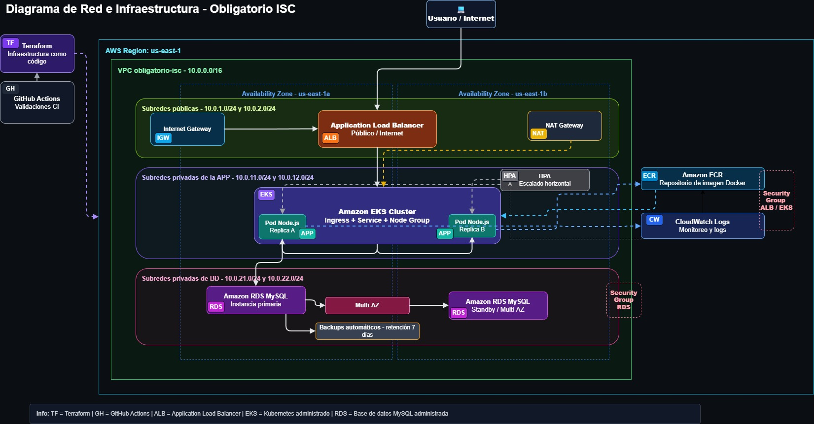

# Obligatorio Implementación de Soluciones Cloud

Repositorio del obligatorio de la materia **Implementación de Soluciones Cloud** de ORT.

## Objetivo

Implementar una solución cloud en AWS para una aplicación Node.js con base de datos MySQL, usando infraestructura como código, contenedores, Kubernetes y automatización de despliegue.

La aplicación elegida fue una API Node.js. No cuenta con frontend gráfico, por lo que se valida mediante endpoints HTTP expuestos públicamente por un Application Load Balancer.

---

## Dependencias y validaciones iniciales

### Dependencias necesarias

* **AWS CLI** - autenticación y operación contra AWS Academy.
* **Terraform** - creación de infraestructura como código.
* **Docker** - construcción de la imagen de la aplicación.
* **kubectl** - administración del cluster EKS.
* **Helm** - instalación del AWS Load Balancer Controller.
* **jq** - lectura de outputs JSON usados por los scripts.
* **curl** - prueba de endpoints HTTP.
* **Git** - control de versiones y trabajo colaborativo.

### Validaciones iniciales

Validar estructura del repositorio:

```bash
./scripts/validar-estructura.sh
```

Validar credenciales AWS:

```bash
aws sts get-caller-identity
```

Validar Terraform:

```bash
terraform -chdir=infraestructura/ambientes/academy validate
```

Validar Docker:

```bash
docker ps
```

---

## Arquitectura de la solución



[Archivo editable del diagrama](docs/imagenes/diagrama_aws_obligatorio_v2.drawio)

### Flujo principal

```text
Internet
  -> Application Load Balancer público
  -> Ingress Kubernetes
  -> Service ClusterIP
  -> Pods Node.js en Amazon EKS
  -> Amazon RDS MySQL privado
```

---

## Componentes principales

* **Application Load Balancer** - expone la aplicación hacia Internet.
* **Amazon EKS** - ejecuta la aplicación en Kubernetes.
* **Pods Node.js** - reemplazan a los servidores de aplicación tradicionales.
* **Service ClusterIP** - expone la aplicación internamente dentro del cluster.
* **Ingress** - define la entrada HTTP hacia la aplicación.
* **AWS Load Balancer Controller** - crea y administra el ALB desde Kubernetes.
* **Amazon RDS MySQL** - base de datos administrada en subredes privadas.
* **RDS Multi-AZ** - mejora la disponibilidad ante fallos de zona.
* **Backups automáticos de RDS** - permiten recuperación ante fallos o pérdida de datos.
* **Amazon ECR** - almacena la imagen Docker de la aplicación.
* **CloudWatch Logs** - centraliza logs para monitoreo básico.
* **Terraform** - define la infraestructura cloud.
* **GitHub Actions** - ejecuta validaciones del repositorio.

---

## Equivalencia con la arquitectura solicitada

| Componente solicitado      | Implementación en AWS                            |
| -------------------------- | ------------------------------------------------ |
| Load balancer              | Application Load Balancer                        |
| Servidores de aplicación   | Pods Node.js en Amazon EKS                       |
| Base de datos              | Amazon RDS MySQL privado                         |
| Solución de respaldos      | Backups automáticos de RDS                       |
| Tolerancia a fallas        | Multi-AZ, subredes en distintas AZ y EKS         |
| Soporte a picos de tráfico | Réplicas, HPA y ALB                              |
| Firewall restringido       | Security Groups y recursos privados              |
| Mejora implementada        | CloudWatch Logs, automatización y GitHub Actions |

---

## Datos principales de infraestructura

* **Región AWS**: `us-east-1`
* **VPC**: `10.0.0.0/16`
* **Subredes públicas**: `10.0.1.0/24`, `10.0.2.0/24`
* **Subredes privadas aplicación**: `10.0.11.0/24`, `10.0.12.0/24`
* **Subredes privadas base de datos**: `10.0.21.0/24`, `10.0.22.0/24`
* **EKS node group**: mínimo 1, deseado 2, máximo 3 nodos
* **RDS**: MySQL privado, Multi-AZ y backups automáticos
* **Logs**: retención de 7 días en CloudWatch

---

## Despliegue

### Variables requeridas

La contraseña de la base de datos no se versiona en el repositorio.

Antes de desplegar:

```bash
export DB_PASSWORD='password_de_la_base'
```

Opcionalmente:

```bash
export AWS_REGION='us-east-1'
export DB_USER='adminisc'
export DB_NAME='obligatorio'
```

---

### Despliegue completo con datos de prueba

```bash
./scripts/desplegar.sh --cargar-datos
```

Ejecuta Terraform, construye la imagen Docker, la publica en ECR, configura EKS, aplica Kubernetes, importa el schema, carga datos de prueba y valida endpoints.

---

### Despliegue sin cargar datos

```bash
./scripts/desplegar.sh --no-cargar-datos
```

Despliega infraestructura y aplicación sin insertar datos de prueba.

---

### Solo cargar datos de prueba

```bash
./scripts/desplegar.sh --solo-cargar-datos
```

Se usa cuando la infraestructura ya está creada y solo se quiere volver a importar el schema/cargar datos para validar la aplicación.

---

### Despliegue sin confirmación manual

```bash
./scripts/desplegar.sh --cargar-datos --auto-approve
```

Ejecuta el despliegue completo sin pedir confirmación de Terraform.

---

## Resultado esperado al finalizar

Al terminar correctamente el despliegue se debería obtener:

* Terraform aplicado sin errores.
* Imagen Docker publicada en Amazon ECR.
* Cluster EKS accesible.
* Nodos Kubernetes en estado `Ready`.
* Pods `nodejs-app` en estado `Running`.
* Service `nodejs-app-service` de tipo `ClusterIP`.
* Ingress con dirección pública de ALB.
* Endpoint `/health` respondiendo correctamente.
* Endpoints funcionales devolviendo datos en formato JSON.
* Evidencia generada en `evidencias/evidencia-despliegue-aws.txt`.

Respuesta esperada del healthcheck:

```json
{"status":"ok","service":"nodejs-obligatorio"}
```

Endpoints de prueba:

```bash
export ALB_HOST="$(kubectl get ingress nodejs-app-ingress -n obligatorio-isc -o jsonpath='{.status.loadBalancer.ingress[0].hostname}')"

curl "http://$ALB_HOST/health"
curl "http://$ALB_HOST/catalog"
curl "http://$ALB_HOST/inventory"
curl "http://$ALB_HOST/customer/1"
curl "http://$ALB_HOST/cart/1"
```

---

## Validaciones posteriores

Validar Kubernetes:

```bash
kubectl get nodes
kubectl get pods -n obligatorio-isc -o wide
kubectl get svc -n obligatorio-isc
kubectl get ingress -n obligatorio-isc
```

Validar logs:

```bash
kubectl logs -n obligatorio-isc deploy/nodejs-app
```

Validar RDS Multi-AZ y backups:

```bash
aws rds describe-db-instances \
  --region us-east-1 \
  --query "DBInstances[*].[DBInstanceIdentifier,MultiAZ,BackupRetentionPeriod,PreferredBackupWindow]" \
  --output table
```

Ver evidencia generada:

```bash
cat evidencias/evidencia-despliegue-aws.txt
```

---

## Seguridad

No se versionan credenciales reales ni secretos.

No se deben subir:

* `.env`
* `terraform.tfvars`
* `secret.yaml`
* kubeconfig
* claves `.pem` o `.key`
* evidencias con endpoints temporales

Buenas prácticas aplicadas:

* RDS en subredes privadas.
* RDS con Multi-AZ.
* RDS con backups automáticos.
* Contraseña de base de datos por variable de entorno.
* Secret de Kubernetes para credenciales.
* Service interno de tipo `ClusterIP`.
* Exposición pública solo mediante ALB.
* Security Groups restringidos a los accesos necesarios.

---

## Limpieza de recursos

Al finalizar la validación o defensa, destruir los recursos para evitar consumo del laboratorio:

```bash
terraform -chdir=infraestructura/ambientes/academy destroy
```

---

## Integrantes

* Fferreira - 187374
* JRecalde - 334170
