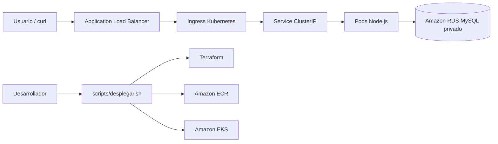

# Obligatorio Implementación de Soluciones Cloud

Repositorio del obligatorio de la materia **Implementación de Soluciones Cloud** de ORT.

## Objetivo

Implementar una solución cloud en AWS para una aplicación Node.js con base de datos MySQL, usando infraestructura como código, contenedores, Kubernetes y automatización de despliegue.

La aplicación no cuenta con frontend gráfico, por lo que se valida mediante endpoints HTTP expuestos públicamente por un Application Load Balancer.

---

## Arquitectura

```text
Internet
  -> Application Load Balancer público
  -> Ingress Kubernetes
  -> Service ClusterIP
  -> Pods Node.js en Amazon EKS
  -> Amazon RDS MySQL privado
```



---

## Componentes principales

* **Terraform**: define y crea la infraestructura en AWS.
* **Docker**: empaqueta la aplicación Node.js en una imagen.
* **Amazon ECR**: almacena la imagen Docker de la aplicación.
* **Amazon EKS**: ejecuta la aplicación en Kubernetes.
* **Amazon RDS MySQL**: base de datos administrada en subredes privadas.
* **RDS Multi-AZ**: mejora la disponibilidad ante fallos de zona.
* **Backups automáticos de RDS**: permiten recuperación ante fallos o pérdida de datos.
* **Application Load Balancer**: expone la aplicación hacia Internet.
* **AWS Load Balancer Controller**: crea y administra el ALB desde Kubernetes.
* **CloudWatch Logs**: centraliza logs para monitoreo básico.
* **GitHub Actions**: ejecuta validaciones del repositorio.

---

## Dependencias necesarias

* **AWS CLI**: autenticación y operación contra AWS Academy.
* **Terraform**: creación de infraestructura como código.
* **Docker**: construcción de la imagen de la aplicación.
* **kubectl**: administración del cluster EKS.
* **Helm**: instalación del AWS Load Balancer Controller.
* **jq**: lectura de outputs JSON usados por los scripts.
* **curl**: prueba de endpoints HTTP.
* **Git**: control de versiones y trabajo colaborativo.

---

## Variables requeridas

La contraseña de la base de datos no se versiona en el repositorio.

Antes de desplegar:

```bash
export DB_PASSWORD='password_de_la_base'
```

Opcionalmente:

```bash
export AWS_REGION='us-east-1'
export DB_USER='adminisc'
export DB_NAME='obligatorio'
```

---

## Despliegue

Despliegue completo con datos de prueba:

```bash
./scripts/desplegar.sh --cargar-datos
```

Solo cargar datos de prueba sobre una infraestructura ya desplegada:

```bash
./scripts/desplegar.sh --solo-cargar-datos
```

El script automatiza Terraform, Docker, ECR, EKS, Kubernetes, AWS Load Balancer Controller, carga de datos, validación de endpoints y generación de evidencia.

---

## Qué deberías ver al finalizar

Al terminar correctamente el despliegue se debería obtener:

* Terraform aplicado sin errores.
* Imagen Docker publicada en Amazon ECR.
* Cluster EKS accesible.
* Nodos Kubernetes en estado `Ready`.
* Pods `nodejs-app` en estado `Running`.
* Service `nodejs-app-service` de tipo `ClusterIP`.
* Ingress con dirección pública de ALB.
* Endpoint `/health` respondiendo correctamente.
* Endpoints funcionales devolviendo datos en formato JSON.
* Evidencia generada en `evidencias/evidencia-despliegue-aws.txt`.

Respuesta esperada del healthcheck:

```json
{"status":"ok","service":"nodejs-obligatorio"}
```

Endpoints de prueba:

```bash
curl "http://$ALB_HOST/health"
curl "http://$ALB_HOST/catalog"
curl "http://$ALB_HOST/inventory"
curl "http://$ALB_HOST/customer/1"
curl "http://$ALB_HOST/cart/1"
```

---

## Validaciones útiles

Validar estructura del repositorio:

```bash
./scripts/validar-estructura.sh
```

Validar Terraform:

```bash
terraform -chdir=infraestructura/ambientes/academy validate
terraform -chdir=infraestructura/ambientes/academy output
```

Validar Kubernetes:

```bash
kubectl get nodes
kubectl get pods -n obligatorio-isc -o wide
kubectl get svc -n obligatorio-isc
kubectl get ingress -n obligatorio-isc
```

Validar RDS Multi-AZ y backups:

```bash
aws rds describe-db-instances \
  --region us-east-1 \
  --query "DBInstances[*].[DBInstanceIdentifier,MultiAZ,BackupRetentionPeriod,PreferredBackupWindow]" \
  --output table
```

---

## Seguridad

No se versionan credenciales reales ni secretos.

No se deben subir:

* `.env`
* `terraform.tfvars`
* `secret.yaml`
* kubeconfig
* claves `.pem` o `.key`
* evidencias con endpoints temporales

Buenas prácticas aplicadas:

* RDS en subredes privadas.
* RDS con Multi-AZ.
* RDS con backups automáticos.
* Contraseña de base de datos por variable de entorno.
* Secret de Kubernetes para credenciales.
* Service interno de tipo `ClusterIP`.
* Exposición pública solo mediante ALB.

---

## Limpieza de recursos

Al finalizar la validación o defensa, destruir los recursos para evitar consumo del laboratorio:

```bash
terraform -chdir=infraestructura/ambientes/academy destroy
```

---

## Integrantes

* Fferreira
* JRecalde

