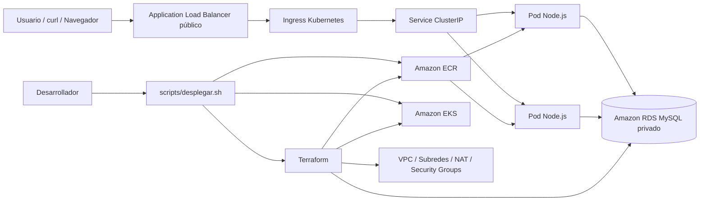

# Obligatorio Implementación de Soluciones Cloud

Repositorio del obligatorio de la materia **Implementación de Soluciones Cloud** de ORT.

## Objetivo

Implementar una solución cloud en AWS para una aplicación Node.js con base de datos MySQL, utilizando infraestructura como código, contenedores, Kubernetes y buenas prácticas DevOps.

La solución busca ser reproducible y validable mediante comandos. Para esto usamos Terraform, Docker, Amazon ECR, Amazon EKS, Amazon RDS MySQL y un Application Load Balancer público.

---

## Arquitectura resumida

```text
Internet
  -> Application Load Balancer público
  -> Ingress Kubernetes
  -> Service ClusterIP
  -> Pods Node.js en Amazon EKS
  -> Amazon RDS MySQL privado
```

La aplicación no tiene frontend gráfico, por lo que se valida mediante endpoints HTTP expuestos por el ALB.

---

## Tecnologías principales

* AWS Academy Learner Lab
* Terraform
* Docker
* Kubernetes / Amazon EKS
* Amazon ECR
* Amazon RDS MySQL
* Application Load Balancer
* AWS Load Balancer Controller
* CloudWatch Logs
* GitHub Actions
* Bash scripts

---

## Estructura del repositorio

```text
aplicacion/        Código fuente y Dockerfile de la aplicación
infraestructura/   Terraform para AWS
kubernetes/        Manifiestos Kubernetes
docs/              Documentación técnica
scripts/           Scripts de despliegue y validación
.github/           Workflows de CI
```

---

## Instalación de dependencias

Se requiere un entorno Linux o WSL con:

* Git
* AWS CLI
* Terraform
* Docker
* kubectl
* Helm
* jq
* curl

Dependencias base en Ubuntu/WSL:

```bash
sudo apt update
sudo apt install -y git curl unzip jq docker.io
sudo usermod -aG docker $USER
```

Luego cerrar y abrir nuevamente la terminal para que tome el grupo `docker`.

Instalar Helm:

```bash
sudo snap install helm --classic
```

Validar herramientas:

```bash
aws sts get-caller-identity
terraform version
docker version
kubectl version --client
helm version
jq --version
```

---

## Variables necesarias

La contraseña de la base de datos no se guarda en el repositorio. Se debe definir antes del despliegue:

```bash
export DB_PASSWORD='password_de_la_base'
```

Opcionalmente:

```bash
export AWS_REGION='us-east-1'
export DB_USER='adminisc'
export DB_NAME='obligatorio'
```

---

## Despliegue automatizado

El despliegue se ejecuta con:

```bash
./scripts/desplegar.sh
```

El script realiza las siguientes tareas:

1. Valida la estructura del repositorio.
2. Ejecuta Terraform.
3. Construye la imagen Docker.
4. Sube la imagen a Amazon ECR.
5. Configura acceso a Amazon EKS.
6. Instala/actualiza AWS Load Balancer Controller.
7. Aplica los manifiestos Kubernetes.
8. Importa el schema de la base de datos.
9. Espera el ALB público.
10. Prueba endpoints.
11. Opcionalmente carga datos de prueba.
12. Genera evidencia del despliegue.

Despliegue completo con datos de prueba:

```bash
export DB_PASSWORD='password_de_la_base'
./scripts/desplegar.sh --cargar-datos
```

Solo cargar datos, sin volver a desplegar infraestructura:

```bash
export DB_PASSWORD='password_de_la_base'
./scripts/desplegar.sh --solo-cargar-datos
```

---

## Pruebas de la aplicación

Obtener el endpoint público del ALB:

```bash
export ALB_HOST="$(kubectl get ingress nodejs-app-ingress -n obligatorio-isc -o jsonpath='{.status.loadBalancer.ingress[0].hostname}')"
echo "$ALB_HOST"
```

Validar healthcheck:

```bash
curl "http://$ALB_HOST/health"
```

Resultado esperado:

```json
{"status":"ok","service":"nodejs-obligatorio"}
```

Validar endpoints funcionales:

```bash
curl "http://$ALB_HOST/catalog"
curl "http://$ALB_HOST/inventory"
curl "http://$ALB_HOST/customer/1"
curl "http://$ALB_HOST/cart/1"
```

Estos endpoints validan que la app responde por Internet, ingresa por el ALB, pasa por Ingress/Service, llega a los pods y consulta datos desde RDS.

---

## Diagrama de arquitectura



---

## Validaciones para defensa

### 1. Terraform

```bash
terraform -chdir=infraestructura/ambientes/academy validate
terraform -chdir=infraestructura/ambientes/academy output
```

Valida que la infraestructura esté definida como código y que existan outputs de VPC, subredes, EKS, RDS y ECR.

### 2. EKS

```bash
kubectl get nodes
kubectl get pods -n obligatorio-isc -o wide
```

Valida que el cluster esté operativo y que los pods estén corriendo.

### 3. Service e Ingress

```bash
kubectl get svc -n obligatorio-isc
kubectl get ingress -n obligatorio-isc
kubectl describe ingress nodejs-app-ingress -n obligatorio-isc
```

Valida que el Service sea interno y que la exposición pública sea mediante ALB.

### 4. Aplicación pública

```bash
curl "http://$ALB_HOST/health"
```

Valida el recorrido completo: Internet -> ALB -> Ingress -> Service -> Pod.

### 5. Datos desde RDS

```bash
curl "http://$ALB_HOST/catalog"
curl "http://$ALB_HOST/inventory"
curl "http://$ALB_HOST/customer/1"
curl "http://$ALB_HOST/cart/1"
```

Valida que la aplicación consulte datos desde la base RDS.

### 6. Evidencia generada

```bash
cat evidencias/evidencia-despliegue-aws.txt
```

El script genera evidencia con outputs de Terraform, estado de pods, Service, Ingress, ALB y respuestas de endpoints.

---

## Seguridad

No se versionan credenciales reales ni secretos.

No se deben subir:

* `.env`
* `terraform.tfvars`
* `secret.yaml`
* kubeconfig
* claves `.pem` o `.key`
* evidencia con endpoints temporales si no es necesaria para la entrega

Buenas prácticas aplicadas:

* La contraseña de la base se pasa por variable de entorno.
* Kubernetes usa Secret para datos sensibles.
* El Service de la app es interno.
* RDS se ubica en subredes privadas.
* El acceso público se concentra en el Application Load Balancer.

---

## Limpieza de recursos

Al finalizar la validación o defensa, se recomienda destruir los recursos para no consumir el laboratorio AWS Academy:

```bash
terraform -chdir=infraestructura/ambientes/academy destroy
```

Antes de destruir, guardar capturas o evidencia del despliegue.

---

## Integrantes

* Fferreira
* JRecalde
