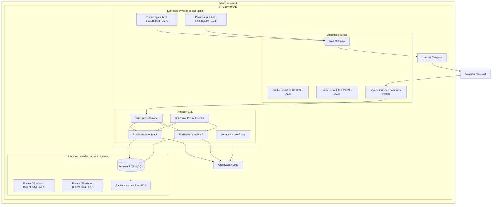

# 12 - Diagrama de arquitectura

## Diagrama general

El siguiente diagrama representa la arquitectura propuesta para la solución cloud en AWS.

## Flujo de tráfico

1. El usuario accede desde Internet.
2. El tráfico entra por el Application Load Balancer asociado al Ingress.
3. El Ingress envía tráfico al Service de Kubernetes.
4. El Service distribuye tráfico hacia los pods Node.js.
5. Los pods se conectan a Amazon RDS MySQL por red privada.
6. RDS no está expuesto públicamente.
7. Los logs de aplicación y EKS se centralizan en CloudWatch Logs.

## Segmentación de red

| Capa | Subredes | Uso |
| --- | --- | --- |
| Pública | 10.0.1.0/24 y 10.0.2.0/24 | ALB, NAT Gateway e Internet Gateway |
| Aplicación privada | 10.0.11.0/24 y 10.0.12.0/24 | Nodos de EKS y pods |
| Base de datos privada | 10.0.21.0/24 y 10.0.22.0/24 | Amazon RDS MySQL |

## Alta disponibilidad

La arquitectura se distribuye en dos zonas de disponibilidad.

Se definen subredes públicas, privadas de aplicación y privadas de base de datos en más de una AZ, permitiendo mejorar disponibilidad y tolerancia a fallas.

## Seguridad

La base de datos se ubica en subredes privadas y no tiene acceso público.

El acceso MySQL se restringe al tráfico desde la capa de aplicación privada.

Los secretos no se almacenan en el repositorio. Se utilizan archivos de ejemplo y placeholders para evitar publicar credenciales.
